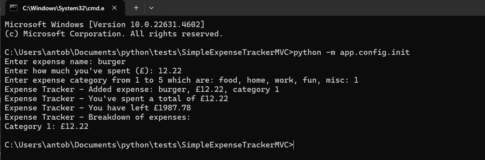
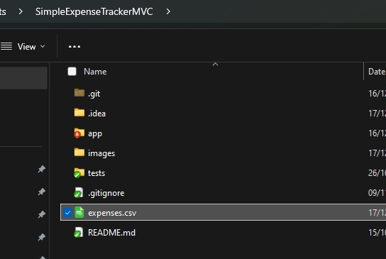
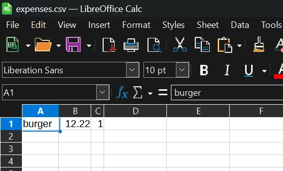

# SimpleExpenseTrackerMVC
Rework of pythonPracticeExpenses with a MVC pattern. 

This app will have the same functionality as the previous one in the 
pythonPracticeExpenses repository, which is, a simple expenses track app but it will follow the MVC pattern.

The data will still be stored in a csv for now.

## How to execute

From the root folder run the main script:
`C:\Users\antob\Documents\python\tests\SimpleExpenseTrackerMVC>python -m app.config.init`

And this gives this output:

This created the following csv file called `expenses.csv`:

This is the content of the csv file:

